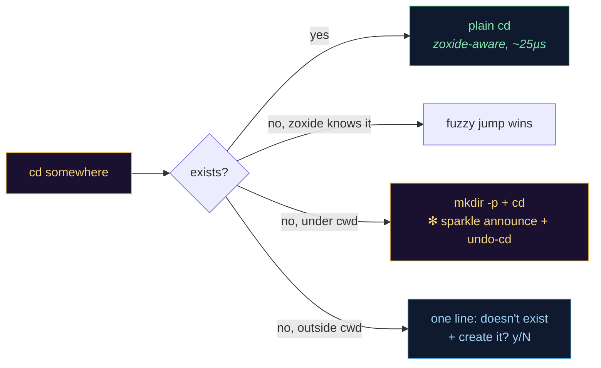

<div align="center">


[](https://github.com/fire17/bettercd/actions/workflows/ci.yml)
[](https://github.com/fire17/bettercd/releases)
[](#performance)
[](tests/suite.sh)
[](#install)
[](LICENSE)
[](https://github.com/fire17/bettercd/stargazers)

<i>cd has two answers: it works, or it wastes your time. This removes the second one.</i>

**[⚡ Quickstart](#install)** · **[✻ The sparkle line](#the-sparkle-line)** · **[🛟 Safety design](#the-safety-design)** · **[🏎 Performance](#performance)** · **[❓ FAQ](#faq)**
</div>

---

# bettercd

**A better `cd` — zoxide-aware, auto-mkdir, with undo. One file of pure shell, zero dependencies, ~25µs overhead.**

```console
$ cd projects/newapp/src        # …doesn't exist yet
+ auto created & cd to /home/you/projects/newapp/src - if you did not mean this - press ↑ or run undo-cd to revert this action

$ cd proj                       # exists in your zoxide history
/home/you/projects/newapp       # fuzzy jump, exactly like before

$ cd /etc/nope                  # outside your cwd — never silently created
✻ /etc/nope doesn't exist — outside your current dir · create it? [y/N]
```

## The sparkle line

The part that should stop you: **the create announcement animates *after* your prompt is back.** The leading `+` cycles unicode sparkles (`✢ ✳ ✶ ✻ ✽`) for ~2 seconds on a line the shell has already scrolled past, then settles — while you're free to type. Terminals don't have a widget for that; it's built from raw pieces:

- The announce is **deferred to a `precmd` hook**, so it prints after ALL command output — the glyph's absolute row (CSI 6n cursor-position report) is exact even for `cd x && make`, at the bottom of the screen, under multi-line prompts.
- A **detached animator** redraws just that one cell, wrapped in cursor save/restore — your typing is untouched; typed-ahead keystrokes the cursor query swallows are pushed back into zsh's editor (`print -z`).
- **precmd/preexec hooks kill it** the instant anything would scroll, so it can never draw on the wrong line.
- Every escape hatch stock `cd` users expect: scripts and non-tty shells get plain static text; `BETTERCD_SPARKLE=0` turns it off entirely.

> [!IMPORTANT]
> All of it is one sourced file of POSIX-leaning shell. No daemon, no compiled helper, no prompt-framework dependency — and the happy path (directory exists) is still ~25µs.



## What it does

- **Type a directory name — skip the `cd` entirely.** `test2` when `./test2` exists (even the nested `test2/deep`) takes you there. That's the shell's own `AUTO_CD`, switched on for interactive zsh **and** bash — native, zero overhead. On zsh it reaches further: a bare word (or `name/sub`) that is *not* a command/alias/builtin and frecency-resolves through zoxide is rewritten to `cd -- <that dir>` before it runs — it resolves to an **existing** dir first, so a mistyped command never becomes a surprise create, and the widget chains to whatever `accept-line` was bound before it (p10k, syntax-highlighting). Off-switches: `BETTERCD_AUTOCD=0`, `BETTERCD_MAGIC_TYPE=0`.
- **`cd` into a directory that doesn't exist, under your cwd → it's created** (`mkdir -p`) and you're in it — announced by a one-liner whose leading `+` **sparkles through unicode glyphs for ~2s** (Claude-Code-style), *after* your prompt is already back. Fully non-blocking: a detached animator redraws just that one cell (cursor save/restore around an absolute-row anchor) and prompt hooks kill it the instant anything would scroll. Scripts and non-tty shells get the plain static message instead.
- **`cd -` twice → a sparkling dropdown of recent places.** Tap `cd -` a second time (or hit it ≥2× within a minute) and a `✻` menu of where you've been drops in — arrows / `j` `k` / digits to move, `⏎` to jump, `esc` to cancel. **Plain Enter picks `$OLDPWD`, so it stays *exactly* `cd -`.** `cd --` opens it directly. Non-interactive shells and `BETTERCD_MAGIC=0` keep the plain classic toggle, untouched. Tune the arm window with `bettercd magic window <min>`.
- **`undo-cd`** (or `bettercd undo`) — go back where you were and remove *exactly* the directories that were created (uses `rmdir` only: anything that gained content is kept, never deleted).
- **Typo guard before it makes junk.** `cd sr` when `src/` sits right there doesn't mkdir `sr` — it asks **`did you mean src/ ?`** first (`[Y=jump / c=create / n=abort]`). Matches are case-folds, unique prefixes, and single edits (add/drop/swap/transpose a char). Interactive only — scripts still auto-create exactly as before (CI-safe). Disable with `BETTERCD_TYPO_GUARD=0`.
- **Editor / stack-trace paste just works.** `cd src/app.py:42` or `cd src/app.py:42:7` (the shape your traceback and `file:line:col` copies come in) strips the `:line[:col]` and drops you in the file's directory — no "no such file or directory".
- **Outside your cwd → never silently created.** One line tells you it doesn't exist *and* asks `[y/N]` — no retyping the command. Scripts and non-interactive shells never get prompts and never get surprise directories.
- **Composes with [zoxide](https://github.com/ajeetdsouza/zoxide), never fights it.** If your `cd` is zoxide-powered (`zoxide init --cmd cd`), fuzzy jumps still win for bare names. A **trailing slash forces creation**: `cd newdir/` means "make it *here*", skipping the fuzzy match.
- **`cd some/file.txt` → jumps to the file's parent directory** instead of erroring.
- **`bettercd doctor`** — checks zoxide is installed and working, whether it owns `cd`, whether fuzzy interactive search (fzf) is available, and that bettercd is loaded in the right order. `--fix` backs up your setup first, then offers to install what's missing.
- **`bettercd backup`** — snapshots your current cd paradigm (your `cd` function, aliases, rc files, zoxide database) plus a `RESTORE.md` with exact steps to return to it.
- **`cd --` — a ✻ dropdown workbench of recent places.** A scrolling, mouse-aware menu of where you've been, with a live row model that stays blazingly fast (every git/tag/mtime fact is computed only for rows you actually look at, once, then cached; the key loop is fork-free). First open seeds a backlog of where you've been *before* bettercd, **merging** zoxide's db (highest recency confidence) with a real **history replay** — a single `awk` pass that *simulates* `cd` across your shell history so even relative moves (`cd /base` → `cd sub` → `cd ..`) resolve to real dirs, with a constraint join for lone `cd <name>`s and a `[ -d ]` truth filter on everything. `cd -` stays exactly classic by default — opt in to auto-magic (`bettercd magic on`: second `cd -` within a minute opens the dropdown for a refreshing 5-min window). `builtin cd -` is always the pure classic toggle.

  **Keys:** `↑↓`/`jk` move · wheel glides · hover selects · `⏎`/click cd · `1`–`9` pick · `g`/`G` top/bottom · **`p` pin** (floats to top, persists to `~/.config/bettercd/pins`) · **`t` mark project** (`.project/`) · **`v` table view** (name · modified · version · shipped) · **`r` sort** (recent → name → modified) · **`l` preset** (all → projects → git → pinned) · **`/` or just type = fuzzy find** · `u` parent · `.` full/home paths · `o` reveal in Finder · `?` help · `esc`/`q` cancel. Rows are colored by git state — green `●` clean, yellow `◐` modified, orange `○` untracked (untracked wins) — projects render bold with `▪`, pins get `⚑`. Fuzzy find that stays thin extends via zoxide + a bounded `find "$HOME"` on a typing pause (dim `+` rows).
- **`cd docs*` — the same table, already filtered.** A trailing star means *"show me the places that look like this"*: the dropdown opens with `docs` **pre-typed as the query**, ranked the way you'd want it — zoxide's own list first, then fuzzy hits from the **current tree**, then everywhere else — all streaming in as it finds them. Keep typing to narrow; **Backspace stops at the word you typed** (`docs` is yours, the menu never eats it); `esc` clears the whole query, `esc` again cancels.

  **On zsh it works even when the glob would match** (`cd bett*` in a dir that *has* `bettercd/`): at Enter-time bettercd reads the star word straight off your command line — **your line is never rewritten**, and the `*` never becomes a visible `\*` — then routes to the table no matter what the glob expanded to. `NOMATCH` is lifted for that one command (restored at the next prompt) so the no-match case reaches the table too, and *only* the exact shape `cd <one-bare-word>*` is ever touched — anything quoted, flagged, multi-word, or carrying another glob char (`cd ~/p*/src`, `cd 'a*'`, `cd a?*`) keeps stock zsh globbing, untouched.
  **On bash** an unmatched `cd zzz*` reaches the table the same way, but a glob that *does* match is expanded by bash before `cd` ever sees it — so `cd bett*` there just cds (one match) or errors with too many arguments (several). Quote it — `cd 'bett*'` — to force the table.
  On an interactive tty this means a directory literally *named* `foo*` can't be reached with `cd foo*` anymore (use `cd ./foo*/`). Scripts and non-tty shells are untouched: no menu, no routing change, stock behavior byte for byte.
- **`cd apiv2` finds the dir you've never visited.** zoxide only knows where you have *been* — a directory that exists but was never entered is invisible to it, so `cd apiv2` used to sail straight past `./src/services/apiv2` and offer to *create* `./apiv2`. Now a miss searches real disk first: **the cwd subtree, then `$HOME`** — exact basename beats a prefix beats a substring, shallowest wins — jumps you there with a `✻ ↪ ~/proj/src/services/apiv2` note, and **teaches zoxide the path**, so the next `cd apiv2` is an instant frecency jump and never scans again. Bounded and only ever on a miss (the happy path is untouched): one pruned `find` per root, cwd 5 deep, `$HOME` 3 deep. Measured on a 34 020-dir tree: hit **173 ms**, worst-case total miss **474 ms**. `cd apiv2/` (trailing slash) still force-creates, skipping the search; `BETTERCD_JUMP=0` turns it off; scripts keep the old flow exactly.
- **`bettercd places`** — see the whole recent-places pool, numbered and home-relative, with a source tag (live / zoxide / history). `bettercd places -n <k>` limits the count.
- **Vanished dirs get a real answer.** `cd -` back to a dir that was renamed/moved? bettercd remembers inodes, finds it, tells you — `✻ test is now test2 — taking you there` — and goes. Actually deleted: a clean `does not exist there anymore (deleted or moved away)` instead of a raw shell error.
- **`cd..` just works** — the classic no-space typo: `cd..` → `cd ..`, `cd...` → `cd ../..`, up to `cd.....`. (`BETTERCD_CD_TYPOS=0` to disable.)
- Flags (`cd -P`), `cd -`, `CDPATH`, dir-stack (`cd +2`), custom `cd` functions: all preserved and passed through.

## Install

**Homebrew**

```sh
brew install fire17/tap/bettercd
```

**curl** (inspect [install.sh](install.sh) first if you like — it only appends a marked block to your shell rc, after backing it up)

```sh
curl -fsSL https://raw.githubusercontent.com/fire17/bettercd/main/install.sh | sh
```

**Manual** — clone and add to your `~/.zshrc` / `~/.bashrc`, *after* any `zoxide init` line:

```sh
source /path/to/bettercd.sh
```

**zinit / oh-my-zsh** — it ships a `bettercd.plugin.zsh`:

```sh
zinit light fire17/bettercd
```

Then restart your shell and run `bettercd doctor`.

> zoxide and fzf are optional. bettercd works without them (auto-create + undo + safety still apply); `bettercd doctor` will offer to install them for the full fuzzy experience.

## The safety design

Auto-creating directories on `cd` is a footgun if done naively. The rules that keep it safe:

| Situation | Behavior |
|---|---|
| Target exists | plain `cd` (zoxide-aware), zero magic |
| Missing, **under cwd** | create + enter + print undo one-liner |
| Missing, **close to a sibling dir** (interactive) | `did you mean src/ ?` before mkdir — jump / create / abort |
| Missing, ends in `:line[:col]` and the stripped path exists | editor/stack-trace paste → cd to the file's dir |
| Missing, bare name with a zoxide match | **fuzzy jump wins** (no typo-mkdir shadowing your history) |
| Missing, **outside cwd** | one line states it's missing and asks `[y/N]` (never silent) |
| `..` tricks (`cd a/../../etc`) | normalized *first* — a path that escapes cwd is treated as outside |
| `cd -` twice / `cd --` (interactive) | sparkling dropdown of recent places; plain Enter === classic `cd -` |
| Missing, but a **real dir of that name exists** (cwd subtree, then `$HOME`) | **jump there** (`✻ ↪ path`) + teach zoxide — instead of creating a new one |
| `cd name*` (interactive) | the places table, pre-filtered on `name` — zoxide hits, then the current tree, then everywhere (zsh: even when the glob matches; bash: only when it doesn't self-resolve) |
| Non-interactive shell / script | no prompts, no auto-create surprises outside cwd; `cd -` is the plain classic toggle |
| Undo | `rmdir` only — never `rm`; non-empty dirs are kept and reported |
| Undo + zoxide | the created dir is also removed from the zoxide database |
| Your old `cd` | detected at load (zoxide / custom function / builtin) and delegated to — never clobbered |

Escape hatches: `BETTERCD_AUTO_CREATE=0` (disable creation), `BETTERCD_AUTOCD=0` (no type-a-name cd), `BETTERCD_MAGIC_TYPE=0` (no zoxide-name rewrite), `BETTERCD_JUMP=0` (no unvisited-dir search), `BETTERCD_QUIET=1` (no hints), `BETTERCD_TYPO_GUARD=0` (no did-you-mean), `BETTERCD_SPARKLE=0` (no animation), `BETTERCD_MAGIC=0` (no `cd -` dropdown), `builtin cd` / `command cd` (bypass entirely).

## Performance

The happy path (directory exists) is one `case` and one `[ -d ]` — no subprocesses, no I/O:

```
wrapper: 36.9µs per cd   builtin: 11.7µs per cd   overhead: ~25µs
```

(zsh 5.9, Apple Silicon.) You could `cd` forty thousand times a second before noticing.

## Commands & options

```
cd <dir>              everything above
cd                    the ✻ places table (scripts still go home)
cd <name>*            the same table, pre-filtered on <name> (backspace floors there)
cd <unvisited-name>   searches cwd subtree then $HOME, jumps, teaches zoxide (✻ ↪)
cd -  (twice)         sparkling dropdown of recent places (cd -- forces it)
  in the dropdown:    p pin · t mark project · v table · r sort · l preset
                      / (or type) fuzzy find · u parent · . paths · o reveal · ? help
undo-cd               revert the last auto-create (go back + rmdir created chain)
bettercd undo         same thing, spelled out
bettercd doctor       health-check zoxide / fzf / load order   (--fix to install)
bettercd backup       snapshot current cd setup + RESTORE.md
bettercd status       mode, pending undo, version
bettercd magic        on | off | status | window <minutes> — the cd - dropdown
bettercd places       list the recent-places pool (-n <k> limits)
cdi <query>           interactive fuzzy cd (zoxide + fzf)

BETTERCD_AUTO_CREATE=0    disable auto-create
BETTERCD_AUTOCD=0         don't enable AUTO_CD (type a dir name to cd into it)
BETTERCD_MAGIC_TYPE=0     don't rewrite a bare zoxide name into cd -- (zsh)
BETTERCD_QUIET=1          suppress hints
BETTERCD_TYPO_GUARD=0     disable the did-you-mean typo guard
BETTERCD_SPARKLE=0        disable the animated create line
BETTERCD_HISTORY_HINT=0   don't push undo-cd into history after a create
BETTERCD_CD_TYPOS=0       don't alias cd.. / cd... typos (set before sourcing)
BETTERCD_MAGIC=1          opt-in: cd - twice also opens the dropdown
BETTERCD_MAGIC=0          disable the cd - recent-places dropdown (classic toggle)
BETTERCD_MAGIC_WINDOW=600 seconds the dropdown stays armed after activating (default 300)
BETTERCD_SPARKLE_GLYPHS   space-separated glyph frames  (default: ✢ ✳ ✶ ✻ ✽ ✻ ✶ ✳)
BETTERCD_SPARKLE_COLORS   space-separated 256-color codes (default: 213 219 177 225)
```

## Uninstall / restore

Remove the `# >>> bettercd >>>` block (or the `source … bettercd.sh` line) from your rc file and restart your shell. Everything bettercd changed lives between those markers; `bettercd backup` snapshots (in `~/.config/bettercd/backups/`) include your original rc files and a `RESTORE.md`.

## FAQ

**Why not just `mkdir -p x && cd x`?** You already know you should. You'll still type `cd x` first. bettercd makes the failure mode cost zero instead of one round-trip.

**Why not zoxide alone?** zoxide answers "take me to a place I've been". bettercd adds the other half: "take me to a place I'm *about* to make" — and wires both together safely.

**Does it slow down my shell?** ~25µs per cd, nothing at startup, no daemons, no hooks beyond the function itself.

**zoxide's doctor complains that it isn't last in my rc?** It would — bettercd deliberately wraps zoxide's `cd` (and delegates to it faithfully), which is exactly what zoxide's heuristic flags. bettercd silences that one false positive by setting `_ZO_DOCTOR=0` in zoxide mode, unless you've set it yourself.

**What shells?** bash and zsh (macOS, Linux, WSL, Git Bash). The core is POSIX-clean and loads under dash and posix-mode sh. fish and PowerShell are on the roadmap.

**What about muscle memory on servers without it?** Fair warning: you may come to expect `cd` to create. On bare machines it just fails like it always did — nothing breaks, you just miss it.

## How it's verified

Every push runs 64 assertions under **bash and zsh** each, a deterministic zoxide-stub suite (6 more per shell), and smoke tests under **both dash and posix-mode sh** — on ubuntu and macos ([CI](https://github.com/fire17/bettercd/actions/workflows/ci.yml)), shellcheck-clean. Releases are gate-checked by installing from the published tap (`brew install fire17/tap/bettercd && brew test`). That gate has caught two real defects before users saw them: zoxide's doctor false-positive (fixed in v0.1.1) and a posix-mode `/bin/sh` sourcing failure (fixed in v0.2.1, same day it shipped).

## Siblings

- [**betterkill**](https://github.com/fire17/betterkill) — a better `kill`: pids, `%jobs`, `:ports`, and names. Same philosophy: compose, never clobber; TERM before KILL; scripts never get surprises.

---

<div align="center">

**Every `cd` you didn't have to retype is time back.**
Star it so the next person's shell stops wasting theirs. ✻

[](https://star-history.com/#fire17/bettercd&Date)

[MIT](LICENSE) © [fire17](https://github.com/fire17)

<sub><i>one file of shell, verified like it matters — the undo command is printed at the moment of the side effect</i></sub>
</div>
